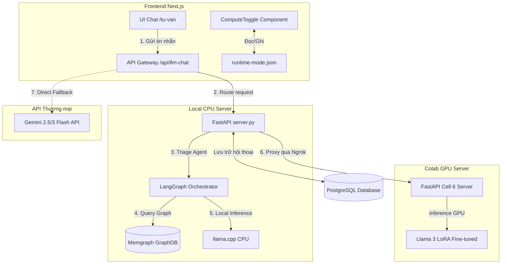

# Bản đồ mã nguồn & Kiến trúc Hệ thống AIMed

Tài liệu này đóng vai trò làm **Bản đồ mã nguồn chính** (Code Map) cho hệ thống tư vấn y tế AIMed. Nó giúp các nhà phát triển và AI trợ lý (AIIDE) nắm bắt nhanh cấu trúc tệp tin, đường đi của luồng dữ liệu và cách định vị mã nguồn.

---

## 1. Sơ đồ cây thư mục dự án

```
medical consulting system/ (Repository Root)
├── .github/                     # Cấu hình GitHub Actions, workflow
├── .trae/                       # Cấu hình quy tắc và kỹ năng của AIIDE (Trae)
│   ├── rules/
│   │   └── project_rules.md     # Luật dự án quy định cách code & fallback
│   └── skills/                  # Các kỹ năng định nghĩa cho AI
├── configs/                     # Cấu hình LLMOps và đánh giá
│   ├── llmops.yaml
│   └── llmops_eval_baseline.yaml
├── core_lib/                    # Thư viện dùng chung của hệ thống Python
│   └── llmops/                  # Module logging, settings, guardrails, tracing
├── postgres-platform/           # Cấu hình Docker PostgreSQL cục bộ
│   ├── docker-compose.yml
│   └── init.sql                 # Khởi tạo schema DB hội thoại, cuộc hẹn
├── memgraph-platform/           # Cấu hình Docker Memgraph (GraphDB) cục bộ
│   └── docker-compose.yml
├── cpu_server/                  # Backend cục bộ (FastAPI) & LangGraph
│   ├── server.py                # Server chính: Routing proxy, STT/TTS gateway, API tra cứu
│   ├── db.py                    # Module quản lý kết nối PostgreSQL & truy vấn
│   ├── graph_gateway.py         # Kết nối và truy vấn cơ sở dữ liệu đồ thị Memgraph
│   ├── safety.py                # Quét mã độc hại, lọc PII y tế nâng cao
│   ├── audio_utils.py           # Tiền xử lý âm thanh cho chat giọng nói
│   ├── langgraph_agent/         # Triage Agent sử dụng LangGraph
│   │   ├── state.py             # Trạng thái hội thoại phân tầng nguy cơ (Pydantic v2)
│   │   └── agent.py             # Logic graph triage và semantic routing
│   └── tests/                   # Bộ unit test cho server Python
├── gpu_server/                  # Môi trường chạy mô hình AI lớn (Colab)
│   └── colab_server/
│       └── server_ai_mcs/       # Scripts chạy trực tiếp trên Google Colab
│           ├── Cell 6 server .py# FastAPI chạy trên Colab hỗ trợ inference Llama GGUF
│           ├── server_AI_MCS.ipynb # Notebook Colab chính để chạy server
│           └── archived/        # Lưu trữ các notebook/scripts cũ dư thừa
├── medical-consultation-app/    # Frontend ứng dụng (Next.js 16 App Router)
│   ├── app/                     # Các Page và API Route của Next.js
│   │   ├── globals.css          # CSS toàn cục
│   │   ├── layout.tsx           # Layout dùng chung (Header, Theme, Toast, Sw)
│   │   ├── page.tsx             # Root page (Redirect tới /vi)
│   │   ├── [locale]/            # Route đa ngôn ngữ (Landing Page /vi, /en)
│   │   ├── api/                 # Các API Routes trung gian (Next.js Gateway)
│   │   │   ├── llm-chat/        # Route gateway chính, điều phối GPU/CPU fallback
│   │   │   └── tam-su-chat/     # Proxy chat bạn thân
│   │   ├── tu-van/              # Giao diện tư vấn y tế AI
│   │   ├── tam-su/              # Giao diện trò chuyện bạn thân
│   │   ├── tra-cuu/             # Giao diện tra cứu thông tin y tế
│   │   ├── sang-loc/            # Giao diện sàng lọc tâm lý (PHQ9, GAD7...)
│   │   └── bac-si/              # Giao diện danh bạ bác sĩ & đặt lịch hẹn
│   ├── components/              # Các UI Components của ứng dụng
│   │   ├── ui/                  # Shadcn UI (button, dialog, input, tabs...)
│   │   ├── chat-interface.tsx   # Toàn bộ giao diện hội thoại tư vấn AI
│   │   ├── health-lookup.tsx    # Giao diện bao ngoài của chức năng tra cứu
│   │   ├── health-lookup/       # Các component con phục vụ tra cứu
│   │   ├── psychological-screening.tsx # Giao diện bài test tâm lý
│   │   ├── assessments/         # Định nghĩa các bộ câu hỏi sàng lọc tâm lý
│   │   ├── compute-toggle.tsx   # Thanh gạt chuyển đổi GPU / CPU
│   │   ├── dtx-tri-lieu.tsx     # Giao diện số hóa liệu trình (DTx)
│   │   └── dtx-reminders.tsx    # Chức năng nhắc nhở uống thuốc/vận động
│   ├── data/                    # Nơi lưu trữ trạng thái chạy SSOT
│   │   ├── runtime-mode.json    # Trạng thái runtime hiện tại (GPU/CPU/URL) (SSOT)
│   │   └── server-registry.json # Danh sách các địa chỉ Colab Ngrok khả dụng
│   ├── lib/                     # Thư viện JS/TS dùng chung cho Next.js
│   │   ├── neon-db.ts           # Kết nối database serverless PostgreSQL
│   │   └── gemini-service.ts    # Service gọi trực tiếp Gemini API
│   └── package.json             # Danh sách dependencies của frontend
├── todo.md                      # Kế hoạch phát triển tổng thể dự án theo Epic
└── lessons.md                   # Các bài học kinh nghiệm và lỗi thường gặp
```

---

## 2. Luồng dữ liệu (Data Flow) & Kiến trúc Hybrid

Hệ thống hoạt động theo cơ chế **Hybrid & Fallback**: Ưu tiên gọi mô hình AI hiệu năng cao chạy trên GPU (Colab qua Ngrok), nếu lỗi sẽ tự động chuyển hướng (fallback) về mô hình nhẹ chạy trên CPU cục bộ (FastAPI), hoặc gọi qua mô hình thương mại (Gemini API) dựa trên cài đặt môi trường.



---

## 3. Bản đồ định tuyến ứng dụng (Application Route Map)

| Đường dẫn (Route) | Chức năng chính | Thành phần giao diện (Component) | API Backend tương ứng |
| :--- | :--- | :--- | :--- |
| `/` hoặc `/vi` | Trang chủ giới thiệu, điều hướng tính năng | [landing-page.tsx](file:///d:/desktop/tlcn/medical%20consulting system/medical-consultation-app/components/landing-page.tsx) | Không có |
| `/tu-van` | Chat tư vấn y tế AI, Triage phân tầng nguy cơ | [chat-interface.tsx](file:///d:/desktop/tlcn/medical%20consulting system/medical-consultation-app/components/chat-interface.tsx) | `/v1/chat/completions` (CPU/GPU) |
| `/tam-su` | Trò chuyện bạn thân giải tỏa stress, tâm sự | [tam-su-minimal.tsx](file:///d:/desktop/tlcn/medical%20consulting system/medical-consultation-app/components/tam-su-minimal.tsx) | `/v1/friend-chat/completions` |
| `/tra-cuu` | Tra cứu thông tin bệnh lý, dược phẩm kèm Graph | [health-lookup.tsx](file:///d:/desktop/tlcn/medical%20consulting system/medical-consultation-app/components/health-lookup.tsx) | `/v1/health-lookup` |
| `/sang-loc` | Làm bài test sàng lọc tâm lý (PHQ-9, GAD-7) | [psychological-screening.tsx](file:///d:/desktop/tlcn/medical%20consulting system/medical-consultation-app/components/psychological-screening.tsx) | Không có (xử lý ở client) |
| `/bac-si` | Danh bạ bác sĩ chuyên khoa và đặt lịch khám | [doctor-profile-view.tsx](file:///d:/desktop/tlcn/medical%20consulting system/medical-consultation-app/components/doctor-profile-view.tsx) | API PostgreSQL (conversations/appointments) |

---

## 4. Các điểm lưu ý cho AIIDE khi chỉnh sửa code

1. **Ưu tiên chạy thử nghiệm cục bộ:** Luôn sử dụng PowerShell để chạy tệp script [start_demo_local.bat](file:///d:/desktop/tlcn/medical%20consulting system/start_demo_local.bat) nhằm khởi động cả Next.js và FastAPI cục bộ trước khi chỉnh sửa.
2. **Không tự ý thay đổi file cấu hình mode:** Mọi cấu hình liên quan đến GPU URL và trạng thái runtime phải tuân thủ Single Source of Truth tại [runtime-mode.json](file:///d:/desktop/tlcn/medical%20consulting system/medical-consultation-app/data/runtime-mode.json).
3. **Giữ cấu trúc tinh gọn:** Không thêm bất kỳ file backup nào dạng `.bak` hoặc `.backup` trực tiếp vào các thư mục code chính. Khi sửa file, hãy dùng các công cụ chỉnh sửa trực tiếp không để lại file thừa.
4. **Hệ thống cảnh báo y tế:** Mọi phản hồi y tế khẩn cấp (như đau ngực, khó thở) bắt buộc phải kích hoạt cảnh báo gọi cấp cứu `115` thông qua triage agent nằm ở `cpu_server/langgraph_agent/agent.py`.
