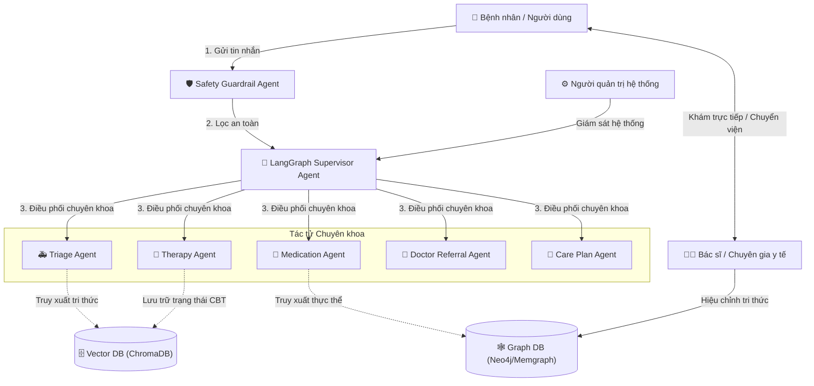

# Đặc tả Hệ sinh thái Tác nhân (Actor Ecosystem Specification)

Tài liệu này đặc tả chi tiết hệ sinh thái các tác nhân (bao gồm tác nhân người và các tác nhân phần mềm AI) trong hệ thống trợ lý y tế số và sức khỏe tinh thần **AiMed**. Sự phối hợp nhịp nhàng giữa các thực thể đảm bảo tính an toàn y khoa, khả năng lập luận lâm sàng chính xác và trải nghiệm tương tác liền mạch của người dùng.

---

## 1. Sơ đồ Tổng quan Hệ sinh thái Tác nhân
Hệ thống AiMed vận hành dựa trên cơ chế tương tác đa bên, kết hợp giữa con người (bệnh nhân, bác sĩ, quản trị viên) và mạng lưới các tác tử AI chuyên khoa được điều phối thông qua đồ thị LangGraph.

---

## 2. Đặc tả Chi tiết các Tác nhân Người (Human Actors)

### 2.1. Bệnh nhân / Người dùng cuối (Patient / End-User)
*   **Mô tả:** Thực thể chính sử dụng hệ thống để tìm kiếm thông tin hỗ trợ y tế.
*   **Vai trò & Nhiệm vụ:**
    *   Cung cấp các triệu chứng thực tế, mô tả trạng thái sức khỏe tinh thần hoặc các câu hỏi tra cứu thuốc.
    *   Tự nguyện thực hiện các bài đánh giá tâm lý chuẩn hóa (như PHQ-9, GAD-7) do hệ thống đề xuất.
    *   Tiếp nhận thông tin sàng lọc nguy cơ, chỉ dẫn sơ cứu và quyết định việc thăm khám trực tiếp tại các cơ sở y tế theo khuyến cáo của hệ thống.
*   **Ràng buộc an toàn:** Không được tự ý thay thế chỉ định điều trị của bác sĩ chuyên khoa bằng các phản hồi của hệ thống.

### 2.2. Bác sĩ / Chuyên gia y tế (Doctor / Medical Expert)
*   **Mô tả:** Thực thể chuyên môn kiểm duyệt và tiếp quản quy trình điều trị lâm sàng ngoài đời thực.
*   **Vai trò & Nhiệm vụ:**
    *   Thực hiện chẩn đoán chính thức và kê đơn thuốc cho bệnh nhân dựa trên các thông tin sàng lọc nguy cơ mà bệnh nhân cung cấp từ ứng dụng.
    *   Tham gia kiểm duyệt, hiệu chỉnh và đóng góp tri thức y học lâm sàng vào cơ sở dữ liệu đồ thị (Graph DB) của hệ thống để loại bỏ các thông tin lỗi thời.
*   **Tương tác:** Tiếp nhận bệnh nhân được chuyển tuyến từ phân hệ giới thiệu bác sĩ (*Doctor Referral*).

### 2.3. Người quản trị hệ thống (System Administrator)
*   **Mô tả:** Thực thể kỹ thuật chịu trách nhiệm vận hành hạ tầng công nghệ của AiMed.
*   **Vai trò & Nhiệm vụ:**
    *   Quản lý cấu hình API đám mây, giám sát trạng thái của máy chủ cục bộ (Llama.cpp CPU) và các dịch vụ cơ sở dữ liệu (Memgraph, ChromaDB).
    *   Cập nhật, nạp các văn bản tri thức mới (data ingestion) vào Vector DB và cập nhật ontology của đồ thị tri thức.
    *   Theo dõi nhật ký lỗi hệ thống (system error logs) để duy trì hoạt động chịu lỗi đa tầng.

---

## 3. Đặc tả Chi tiết các Tác nhân Hệ thống AI (Software Agents)

Hệ thống AI của AiMed được chia nhỏ thành các tác tử chuyên biệt có trách nhiệm rạch ròi nhằm tối ưu hóa tính chính xác và an toàn.

| Tác nhân AI | Vai trò chính | Tri thức sử dụng | Hành vi mặc định khi lỗi (Fallback) |
| :--- | :--- | :--- | :--- |
| **Safety Guardrail Agent** | Chốt chặn an toàn y tế và xã hội ở cổng API Gateway. | Bộ lọc từ khóa động, biểu thức chính quy (Regex), thuật toán khử dấu `stripAccents`. | Tự động trả về thông tin SOS và hướng dẫn gọi cấp cứu 115 mà không gọi LLM. |
| **LangGraph Supervisor Agent** | Điều phối trung tâm, phân tích ý định và định tuyến công việc. | Prompt định tuyến ngữ cảnh, lịch sử hội thoại của phiên làm việc. | Tự động hạ cấp sang bộ định tuyến Heuristic dựa trên từ khóa tĩnh. |
| **Triage Agent** | Sàng lọc mức độ nguy kịch và hướng dẫn sơ cứu khẩn cấp. | Tri thức cấp cứu khẩn cấp, nhận diện Red Flags (FAST, đột quỵ). | Chuyển tiếp khẩn cấp thông tin sang số điện thoại cấp cứu 115. |
| **Medication Agent** | Tra cứu liều lượng, tác dụng phụ và tương tác dược chất. | Đồ thị tri thức (Graph DB) y học lâm sàng và quan hệ tương tác thuốc. | Chỉ hiển thị thông tin cảnh báo an toàn chung từ Dược thư Quốc gia. |
| **Therapy Agent** | Trị liệu nhận thức hành vi (CBT) và theo dõi sức khỏe tâm thần. | Phác đồ Stepped Care, thang đo PHQ-9/GAD-7, kỹ thuật kích hoạt hành vi. | Đề xuất các bài tập hít thở cơ bản và khuyến nghị gặp chuyên gia tâm lý. |
| **Doctor Referral Agent** | Định hướng chuyên khoa và gợi ý phòng khám/bác sĩ phù hợp. | Danh sách bác sĩ chuyên khoa và bản đồ phân bố phòng khám liên kết. | Cung cấp danh sách các bệnh viện tuyến đầu gần nhất theo khu vực. |
| **Care Plan Agent** | Thiết lập kế hoạch dinh dưỡng, thói quen sinh hoạt và phục hồi. | Hướng dẫn dinh dưỡng lâm sàng, bài tập yoga/vật lý trị liệu cơ bản. | Đưa ra lời khuyên sinh hoạt lành mạnh chung (uống nước, ngủ đủ giấc). |

---

## 4. Luồng tương tác điển hình của các Tác nhân (Interaction Flow)

Sự phối hợp giữa các tác nhân được minh họa qua luồng xử lý câu hỏi của bệnh nhân dưới đây:

1.  **Gửi yêu cầu:** **Bệnh nhân** gửi truy vấn qua giao diện Chatbot.
2.  **Kiểm tra an toàn:** **Safety Guardrail Agent** quét nội dung. Nếu phát hiện ý định tự hại hoặc ngộ độc thuốc, nó lập tức chặn luồng xử lý LLM và trả lời hướng dẫn SOS. Nếu an toàn, yêu cầu được chuyển tiếp đến **Supervisor Agent**.
3.  **Phân tích & Phân luồng:** **Supervisor Agent** phân tích ý định, lựa chọn tác tử chuyên khoa phù hợp (ví dụ: phát hiện câu hỏi về tương tác thuốc $\rightarrow$ chọn **Medication Agent**).
4.  **Truy xuất tri thức:** **Medication Agent** thực hiện truy vấn đồ thị liên kết trên **Graph DB** và kiểm tra chéo các đoạn văn bản thô trên **Vector DB**.
5.  **Tổng hợp & Trình bày:** Tác tử chuyên khoa tổng hợp câu trả lời y tế có trích dẫn nguồn uy tín và chuyển trả lại giao diện cho **Bệnh nhân**.
6.  **Chuyển tiếp thực tế:** Trong trường hợp triệu chứng nặng, **Triage Agent** và **Referral Agent** sẽ cùng phối hợp đề xuất danh sách phòng khám để **Bệnh nhân** kết nối trực tiếp với **Bác sĩ** ngoài đời thực.
