# PHẦN HIỆU CHỈNH: TIỂU KẾT CHƯƠNG 1 & SƠ ĐỒ HÌNH 1.7

Dưới đây là phần nội dung văn bản hiệu chỉnh cho phần Tiểu kết Chương 1 của luận văn tốt nghiệp, bao gồm đoạn văn dẫn dắt ngắn và mã nguồn biểu đồ **Mermaid Diagram** được thiết kế lại với cỡ chữ to, khoảng cách thoáng, giúp biên dịch sang Word sắc nét và dễ đọc.

---

## 1. Nội dung đề xuất chèn vào cuối Chương 1

Để tổng kết toàn bộ các định hướng lý thuyết và giải pháp công nghệ đã phân tích trong chương khởi đầu, cấu trúc tổng hòa của hệ thống AiMed được mô phỏng trực quan thông qua sự kết hợp liên ngành giữa khoa học máy tính và tâm lý học lâm sàng.

[CHÈN HÌNH 1.7: Sơ đồ Mindmap tổng hợp sự giao thoa của 4 trụ cột công nghệ và y học tạo nên hệ thống AiMed]

### Sơ đồ Mermaid (Hình 1.7) của hệ thống AiMed:

```mermaid
flowchart TD
    %% Định nghĩa phong cách hiển thị với kích thước chữ lớn
    classDef tech fill:#F9F0FF,stroke:#800080,stroke-width:2.5px,font-weight:bold,color:#4B0082;
    classDef med fill:#FFF0F0,stroke:#FF0000,stroke-width:2.5px,font-weight:bold,color:#8B0000;

    P1["TRỤ CỘT 1: KIẾN TRÚC PHẦN CỨNG LAI (HYBRID GPU-CPU FALLBACK)<br/>• GPU Cloud (Primary) làm lõi xử lý chính, hiệu năng cao, độ trễ thấp.<br/>• CPU Local (Fallback) chạy hoàn toàn offline qua Llama.cpp & Llama-3.1-8B.<br/>• Tự động chuyển tải và phục hồi dịch vụ (SLA) dưới 2,0 giây khi có sự cố mạng."]:::tech
    
    P2["TRỤ CỘT 2: LUỒNG ĐA TÁC TỬ KIỂM SOÁT (MULTI-AGENT ROUTING)<br/>• Sử dụng Semantic Router ở biên để định tuyến ý định người dùng tức thì.<br/>• Tách biệt phân tích của Tác tử Y khoa và giao tiếp của Tác tử Tâm lý.<br/>• Triệt tiêu hiện tượng xung đột ngữ cảnh trong cùng một phiên xử lý."]:::tech
    
    P3["TRỤ CỘT 3: MÔ HÌNH CHĂM SÓC PHÂN TẦNG (STEPPED CARE & SÀNG LỌC)<br/>• Số hóa và tích hợp trắc nghiệm PHQ-9 & GAD-7 ngầm vào cuộc trò chuyện.<br/>• Tự động hóa lộ trình can thiệp cá nhân hóa thích ứng theo 4 cấp độ trị liệu.<br/>• SOS Emergency Mode ngắt khẩn cấp ở biên, hiển thị hotline 115 cứu hộ."]:::med
    
    P4["TRỤ CỘT 4: RÀNG BUỘC CHỨNG CỨ Y KHOA (NEO4J/MEMGRAPH GRAPHRAG)<br/>• Xây dựng đồ thị mạng lưới tri thức y khoa tiếng Việt làm cơ sở dữ liệu nền.<br/>• Bóc tách và tiêm bằng chứng ngữ cảnh (Evidence Subgraph) trực tiếp vào prompt.<br/>• Cơ chế chống ảo giác y khoa (Anti-hallucination) dựa trên ràng buộc chứng cứ."]:::med

    %% Kết nối luồng đứng dọc
    P1 ==> P2 ==> P3 ==> P4
```

---

## 2. Phần văn bản đóng góp kỹ thuật bổ trợ

Dựa trên quá trình thiết kế, triển khai và đánh giá, khóa luận mang lại 4 đóng góp chính về mặt kỹ thuật phần mềm y tế:

*   **Đề xuất kiến trúc phần cứng lai (Hybrid GPU-CPU Fallback):** Hệ thống tích hợp thuật toán định tuyến thông minh, tự động chuyển tải (fallback) từ GPU trên đám mây sang CPU cục bộ khi mất kết nối, đảm bảo tính liên tục của dịch vụ y tế.
*   **Xây dựng luồng đa tác tử có kiểm soát (Multi-Agent Routing):** Tách biệt logic lập luận của Tác tử Y khoa và khả năng giao tiếp của Tác tử Tâm lý [11], triệt tiêu hiện tượng xung đột ngữ cảnh trong cùng một phiên xử lý.
*   **Tích hợp đánh giá tâm lý ngầm theo mô hình Stepped Care:** Số hóa thành công thang đo PHQ-9 và GAD-7 vào luồng giao tiếp, cho phép AI tự động phân loại nguy cơ và đề xuất hành vi can thiệp vi mô mà không gây áp lực khảo sát cho người dùng.
*   **Giảm nguy cơ sinh thông tin không có căn cứ bằng GraphRAG:** Chuyển đổi dữ liệu y khoa tiếng Việt thành cấu trúc đồ thị mạng lưới trên Neo4j/Memgraph, ép buộc mô hình ngôn ngữ phải nội suy dựa trên các mối liên hệ đã được đối chiếu, nâng cao tính minh bạch.

Bốn trụ cột đóng góp công nghệ này được tổng hợp trực quan trong **Hình 1.7**.
