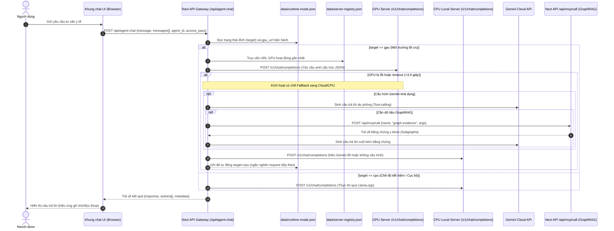
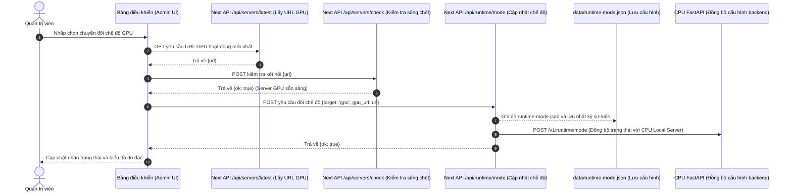

# PHỤ LỤC F: ĐẶC TẢ HỆ THỐNG VÀ KIẾN TRÚC THIẾT KẾ

Phụ lục này trình bày các đặc tả kỹ thuật chi tiết về hệ thống y tế số AiMed, bao gồm đặc tả trường hợp sử dụng (Use Cases), biểu đồ bối cảnh và trình tự tương tác (Sequence Diagrams), cùng thiết kế cơ sở dữ liệu chi tiết của hệ thống.

---

## F.1. Đặc tả các trường hợp sử dụng (Use Cases) của hệ thống AiMed

Kiến trúc AiMed được vận hành xung quanh các quy trình tương tác y tế số khép kín, đảm bảo tính phân tầng (Stepped Care) và kiểm soát an toàn nghiêm ngặt.

### 1. Phân hệ Tư vấn AI chuyên sâu & Tự động đề xuất Tác tử (AI Consultation)
*   **Tác nhân (Actor):** Bệnh nhân / Người dùng.
*   **Mô tả:** Bệnh nhân nhập triệu chứng hoặc câu hỏi sức khỏe dạng văn bản tự nhiên.
*   **Luồng xử lý chính:**
    1.  Người dùng gửi tin nhắn qua giao diện Chat.
    2.  Hệ thống chạy **Semantic Router** để phân tích ý định (Intent) và tự động định tuyến đến Agent chuyên khoa tối ưu (Triage, Therapy, Medication, Doctor Referral, Care Plan, Default).
    3.  Tác tử được chỉ định sẽ truy vấn cơ sở dữ liệu đồ thị tri thức **GraphRAG** để lấy chứng cứ y khoa (Evidence Subgraph).
    4.  Mô hình LLM tổng hợp câu trả lời kèm theo chú thích nguồn gốc bằng chứng (provenance) gửi lại cho người dùng.
*   **Trường hợp ngoại lệ (Safety Trigger):** Nếu phát hiện từ khóa tự hại, tự tử hoặc bạo lực, hệ thống ngắt luồng suy luận thông thường và kích hoạt ngay **Lớp bảo vệ SOS** (SOS Mode), hiển thị thông tin cấp cứu 115 và số hotline hỗ trợ khẩn cấp.

### 2. Phân hệ Can thiệp Trị liệu chánh niệm tự lực (Mindfulness Therapy)
*   **Tác nhân:** Bệnh nhân / Người dùng.
*   **Mô tả:** Bệnh nhân thực hiện các bài tập trị liệu tự lực ở Cấp độ 1 & 2 của mô hình Stepped Care.
*   **Luồng xử lý chính:**
    1.  Bệnh nhân truy cập "Phòng trị liệu chánh niệm".
    2.  Lựa chọn bài tập thở (ví dụ: Box Breathing hoặc thở nhịp sinh học 4-7-8).
    3.  Frontend hiển thị vòng tròn nhịp thở giãn nở động theo thời gian thực để bệnh nhân điều hòa nhịp thở.
    4.  Hệ thống đề xuất các danh sách nhạc sóng não (Alpha, Delta) hoặc âm thanh thiên nhiên từ YouTube API dựa trên tâm trạng (mood) được phân tích từ cuộc hội thoại.

### 3. Phân hệ Đặt lịch hẹn và Kết nối bác sĩ chuyên khoa (Doctor Referral)
*   **Tác nhân:** Bệnh nhân, Bác sĩ chuyên khoa.
*   **Mô tả:** Điều hướng bệnh nhân có nguy cơ cao (Cấp độ 3 & 4) đến bác sĩ chuyên khoa thực tế.
*   **Luồng xử lý chính:**
    1.  Hệ thống phát hiện tình trạng người bệnh vượt quá khả năng tư vấn an toàn của AI (hoặc điểm trắc nghiệm PHQ-9/GAD-7 cao).
    2.  AI hiển thị thẻ chuyển tuyến (Referral Card) trực quan ngay trong khung chat.
    3.  Người dùng nhấp vào thẻ để chuyển đến Thư mục danh sách bác sĩ chuyên khoa.
    4.  Người dùng lọc bác sĩ theo chuyên khoa, vị trí địa lý, xem hồ sơ năng lực và đặt lịch hẹn khám trực tiếp.

### 4. Phân hệ Đồng bộ thiết bị không dùng tài khoản (Device Sync)
*   **Tác nhân:** Người dùng (sử dụng nhiều thiết bị).
*   **Mô tả:** Đồng bộ hóa dữ liệu hội thoại và sinh hiệu giữa điện thoại di động và máy tính mà không cần bắt buộc đăng ký tài khoản (bảo mật quyền riêng tư y tế).
*   **Luồng xử lý chính:**
    1.  Người dùng chọn "Liên kết thiết bị" trên thiết bị A để tạo mã QR chứa Device ID tạm thời.
    2.  Sử dụng thiết bị B quét mã QR để gửi yêu cầu liên kết.
    3.  API Gateway xác thực và liên kết hai mã định danh thiết bị vào cùng một nhóm đồng bộ.
    4.  Dữ liệu lịch sử chat và chỉ số huyết áp, nhịp tim được đồng bộ bất đồng bộ thông qua hàng đợi `sync_queue`.

---

## F.2. Kiến trúc luồng dữ liệu và Biểu đồ trình tự (Sequence Diagrams)

### 1. Biểu đồ bối cảnh hệ thống (System Context Diagram)
Dưới đây là sơ đồ kiến trúc tổng quan mô tả luồng giao tiếp giữa Frontend Next.js, API Gateway, Backend FastAPI (CPU Server), máy chủ GPU đám mây (Colab/Ngrok) và các tầng cơ sở dữ liệu.

```mermaid
flowchart LR
  U[Trình duyệt Người dùng] --> UI[Giao diện Next.js<br/>medical-consultation-app]

  UI -->|POST /api/llm-chat| GW[/Gateway API: llm-chat/]
  UI -->|POST /api/agent-chat (agentMode)| AG[/Gateway API: agent-chat/]
  UI -->|POST /api/runtime/mode| RM[/Gateway API: runtime/mode/]
  UI -->|/api/backend/v1/*| BP[/Gateway API: backend proxy/]
  AG -->|tool calls| MCP[/Gateway API: /api/mcp/call/]

  RM -->|Ghi dữ liệu| SSOT[(data/runtime-mode.json)]
  GW -->|Đọc cấu hình| SSOT
  AG -->|Đọc cấu hình| SSOT
  GW -->|Đọc cấu hình| REG[(data/server-registry.json)]
  AG -->|Đọc cấu hình| REG

  BP -->|Chuyển tiếp| CPU[FastAPI CPU<br/>cpu_server/server.py<br/>http://127.0.0.1:8000]
  GW -->|/v1/chat/completions (CPU target)| CPU
  AG -->|/v1/chat/completions (CPU target)| CPU

  GW -->|/v1/chat/completions (GPU target)| GPU[Máy chủ GPU OpenAI-compatible<br/>Colab/Ngrok hoặc vLLM]
  CPU -->|Proxy (khi target=gpu)| GPU
  AG -->|/v1/chat/completions (GPU target)| GPU

  GW -->|Dịch vụ phụ| GEM[Gemini API]
  AG -->|Dịch vụ phụ| GEM

  GW --> MET[(data/runtime-metrics.jsonl)]
  GW --> EVT[(data/runtime-events.jsonl)]
  AG --> MET
  AG --> EVT
  RM --> EVT
```

### 2. Biểu đồ trình tự xử lý hội thoại đa tác tử (Chat Request Sequence Diagram)
Mô tả chi tiết luồng xử lý của một yêu cầu hội thoại khi đi qua API Gateway, thực hiện định tuyến, gọi công cụ MCP và xử lý chuyển đổi dự phòng (Fallback) khi máy chủ GPU gặp sự cố.



### 3. Biểu đồ chuyển đổi môi trường tính toán (Computing Target Switching Sequence)
Mô tả quy trình đồng bộ trạng thái SSOT khi quản trị viên chuyển đổi thủ công cấu hình thực thi giữa GPU đám mây và CPU cục bộ trên Trang quản trị (Admin Dashboard).



---

## F.3. Đặc tả thiết kế cơ sở dữ liệu chi tiết (Database Schema Specification)

Hệ thống AiMed sử dụng cấu trúc lưu trữ lai (Hybrid Storage): Cơ sở dữ liệu đồ thị (Neo4j/Memgraph) lưu trữ tri thức y khoa lâm sàng, trong khi cơ sở dữ liệu quan hệ (SQLite/PostgreSQL) quản lý dữ liệu vận hành của người dùng.

### 1. Bảng `app_chat_sessions` (Phiên hội thoại người dùng)
*   **session_id** (TEXT PRIMARY KEY): Định danh duy nhất cho từng phiên chat của người bệnh.
*   **kind** (TEXT NOT NULL DEFAULT 'unknown'): Phân loại phiên (`consultation` - tư vấn y tế chuyên khoa, `friend` - chitchat/trò chuyện hỗ trợ, `speech_stream` - luồng giọng nói).
*   **created_at** (TIMESTAMPTZ): Mốc thời gian khởi tạo phiên hội thoại.
*   **updated_at** (TIMESTAMPTZ): Mốc thời gian cập nhật nội dung gần nhất.

### 2. Bảng `app_chat_messages` (Tin nhắn chi tiết trong phiên)
*   **id** (BIGSERIAL PRIMARY KEY): Định danh tự tăng duy nhất cho từng tin nhắn.
*   **session_id** (TEXT NOT NULL REFERENCES app_chat_sessions(session_id) ON DELETE CASCADE): Khóa ngoại kết nối phiên hội thoại tương ứng.
*   **role** (TEXT NOT NULL): Vai trò gửi tin nhắn (`user` - câu hỏi của người bệnh, `assistant` - phản hồi từ trợ lý AI).
*   **content** (TEXT NOT NULL DEFAULT ''): Toàn văn nội dung tin nhắn.
*   **created_at** (TIMESTAMPTZ): Thời điểm tin nhắn được gửi đi.

### 3. Bảng `device_profiles` (Hồ sơ thiết bị người dùng)
*   **device_id** (VARCHAR PRIMARY KEY): Định danh duy nhất cho từng thiết bị cài đặt ứng dụng.
*   **device_name** (VARCHAR): Tên thiết bị (ví dụ: Chrome Web, iPhone Mobile).
*   **device_type** (VARCHAR): Loại thiết bị (`web`, `mobile`, `tablet`).
*   **user_id** (VARCHAR, Nullable): Khóa liên kết tài khoản người dùng (nếu có đăng nhập).
*   **last_synced** (TIMESTAMP): Mốc thời gian đồng bộ dữ liệu gần nhất.
*   **is_active** (BOOLEAN): Trạng thái hoạt động của thiết bị.
*   **created_at**, **updated_at** (TIMESTAMP): Thời gian tạo và cập nhật hồ sơ thiết bị.

### 4. Bảng `sync_queue` (Hàng đợi đồng bộ hóa dữ liệu)
*   **id** (VARCHAR PRIMARY KEY): Định danh duy nhất cho sự kiện đồng bộ.
*   **device_id** (VARCHAR NOT NULL REFERENCES device_profiles(device_id)): Định danh thiết bị phát sinh thay đổi.
*   **user_id** (VARCHAR, Nullable): Liên kết tài khoản người dùng để đồng bộ chéo.
*   **entity_type** (VARCHAR): Loại thực thể thay đổi (`chat_message`, `agent_suggestion`, `content_recommendation`, `appointment`).
*   **entity_id** (VARCHAR): Khóa định danh của thực thể bị thay đổi.
*   **action** (VARCHAR): Hành động thay đổi (`create`, `update`, `delete`).
*   **device_timestamp** (TIMESTAMP): Thời gian thay đổi ghi nhận tại thiết bị.
*   **synced_at** (TIMESTAMP): Thời gian đồng bộ lên server thành công.

### 5. Bảng `agent_suggestions` (Lịch sử đề xuất Tác tử tự động)
*   **id** (VARCHAR PRIMARY KEY): Định danh bản ghi đề xuất.
*   **conversation_id** (VARCHAR NOT NULL): Liên kết đến phiên hội thoại hiện tại.
*   **agent_id** (VARCHAR): Mã định danh tác tử được đề xuất (ví dụ: `therapy`, `medication`).
*   **reason** (TEXT): Lý do hệ thống đề xuất tác tử này (phân tích từ nội dung chat).
*   **suggested_at** (TIMESTAMP): Thời điểm đưa ra đề xuất.
*   **user_selected** (VARCHAR, Nullable): Phản hồi của người dùng đối với đề xuất (`embed` - mở trực tiếp, `link` - nhấp xem, `ignored` - bỏ qua).

### 6. Bảng `content_recommendations` (Nhật ký gợi ý nội dung bổ trợ)
*   **id** (VARCHAR PRIMARY KEY): Định danh duy nhất.
*   **conversation_id** (VARCHAR NOT NULL): Liên kết đến phiên hội thoại.
*   **content_type** (VARCHAR): Loại nội dung đề xuất (`youtube_video`, `mindfulness_audio`, `article`).
*   **external_id** (VARCHAR): Định danh của nội dung trên nền tảng gốc (ví dụ: YouTube Video ID).
*   **title** (VARCHAR): Tiêu đề nội dung.
*   **url** (VARCHAR): Đường dẫn liên kết trực tiếp.
*   **mood_tags** (JSONB): Các nhãn trạng thái cảm xúc tương thích với nội dung (ví dụ: `["stress", "anxiety"]`).
*   **recommended_at** (TIMESTAMP): Thời điểm gợi ý.
*   **user_feedback** (VARCHAR, Nullable): Đánh giá của người dùng (`helpful`, `not_helpful`, `saved`).

### 7. Bảng `doctor_profiles` (Hồ sơ thông tin bác sĩ)
*   **doctor_id** (TEXT PRIMARY KEY): Định danh duy nhất của bác sĩ chuyên khoa trên hệ thống.
*   **public_json** (JSONB NOT NULL DEFAULT '{}'): Lưu trữ thông tin công khai dưới dạng JSON (Họ tên, danh hiệu, các chuyên khoa, phòng khám...).
*   **private_json** (JSONB NOT NULL DEFAULT '{}'): Các thiết lập tài khoản riêng tư của bác sĩ.
*   **updated_at** (TIMESTAMPTZ): Mốc thời gian cập nhật thông tin bác sĩ.

### 8. Bảng `doctor_appointments` (Thông tin đặt lịch hẹn khám bác sĩ)
*   **id** (TEXT PRIMARY KEY): Định danh duy nhất của lịch hẹn khám.
*   **doctor_id** (TEXT NOT NULL REFERENCES doctor_profiles(doctor_id)): Bác sĩ chuyên khoa tiếp nhận đặt lịch hẹn.
*   **patient_id** (TEXT, Nullable): Khóa tài khoản người bệnh thực hiện đặt lịch.
*   **patient_name** (TEXT NOT NULL): Họ và tên của bệnh nhân đến khám.
*   **contact** (JSONB NOT NULL DEFAULT '{}'): Thông tin liên hệ bệnh nhân (số điện thoại, địa chỉ, email).
*   **scheduled_at** (TIMESTAMPTZ NOT NULL): Ngày giờ khám lâm sàng đã lên lịch.
*   **reason** (TEXT NOT NULL): Lý do đi khám bệnh / Triệu chứng lâm sàng sơ bộ.
*   **status** (TEXT NOT NULL DEFAULT 'pending'): Trạng thái lịch khám (`pending` - đang chờ, `confirmed` - đã xác nhận, `completed` - đã khám xong, `cancelled` - đã hủy).
*   **created_at** (TIMESTAMPTZ): Thời điểm ghi nhận lịch hẹn trên hệ thống.

### 9. Bảng `app_user_state` (Trạng thái và điểm sàng lọc sức khỏe bệnh nhân)
*   **owner_id** (TEXT NOT NULL): Định danh chủ sở hữu dữ liệu sức khỏe (định dạng `device:<device_id>` hoặc mã định danh user).
*   **namespace** (TEXT NOT NULL): Phân nhóm trạng thái (ví dụ: `screening` cho khảo sát thang đo, `vitals` cho chỉ số sinh tồn).
*   **key** (TEXT NOT NULL): Khóa định danh của chỉ số đo lường cụ thể (ví dụ: `phq9`, `gad7`, `blood_pressure`, `heart_rate`).
*   **value** (JSONB NOT NULL): Giá trị dữ liệu động lưu dưới dạng JSON (điểm số khảo sát, huyết áp tâm thu/tâm trương, nhịp tim...).
*   **created_at** (TIMESTAMPTZ): Thời gian ghi nhận trạng thái ban đầu.
*   **updated_at** (TIMESTAMPTZ): Thời gian cập nhật trạng thái gần nhất.
*   *Khóa chính:* PRIMARY KEY (owner_id, namespace, key).
